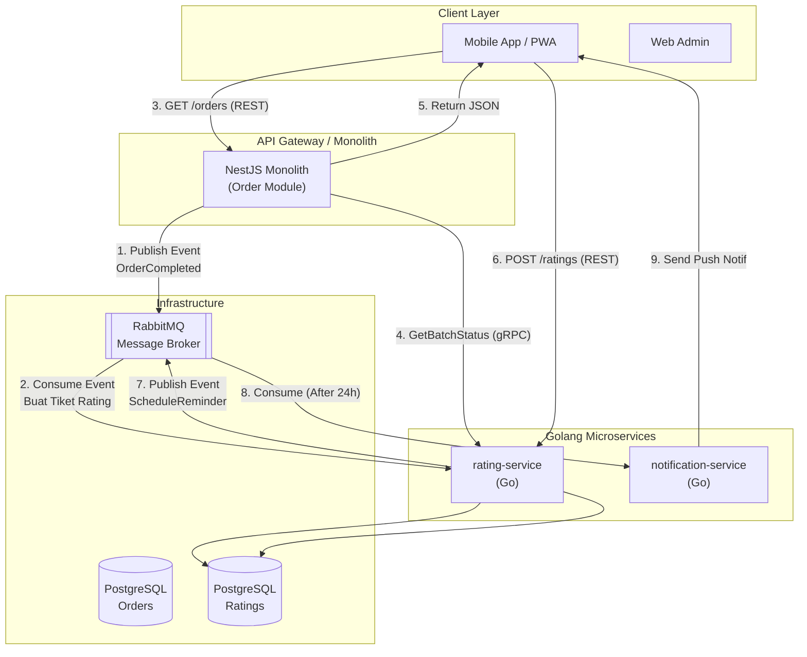

### 1. High-Level Diagram Architecture

```mermaid
flowchart TB
    subgraph Client["Client Layer"]
        FE["Mobile App / PWA"]
        Admin["Web Admin"]
    end

    subgraph Gateway["API Gateway / Monolith"]
        NestJS["NestJS Monolith<br/>(Order Module)"]
    end

    subgraph Microservices["Golang Microservices"]
        RS["rating-service<br/>(Go)"]
        NS["notification-service<br/>(Go)"]
    end

    subgraph Infrastructure["Infrastructure"]
        DB_Nest[("PostgreSQL<br/>Orders")]
        DB_Rating[("PostgreSQL<br/>Ratings")]
        RMQ[["RabbitMQ<br/>Message Broker"]]
    end

    %% Flow 1: Order Selesai (Asynchronous)
    NestJS -->|"1. Publish Event<br/>OrderCompleted"| RMQ
    RMQ -->|"2. Consume Event<br/>Buat Tiket Rating"| RS
    RS --> DB_Rating

    %% Flow 2: Lihat Daftar Order (Synchronous)
    FE -->|"3. GET /orders (REST)"| NestJS
    NestJS -->|"4. GetBatchStatus (gRPC)"| RS
    NestJS -->|"5. Return JSON"| FE

    %% Flow 3: Submit Rating (Synchronous)
    FE -->|"6. POST /ratings (REST)"| RS
    RS --> DB_Rating

    %% Flow 4: Delayed Reminder (Asynchronous)
    RS -->|"7. Publish Event<br/>ScheduleReminder"| RMQ
    RMQ -->|"8. Consume (After 24h)"| NS
    NS -->|"9. Send Push Notif"| FE
```
